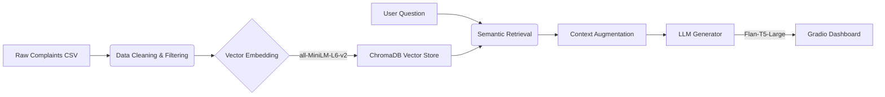

# 🏦 CrediTrust Financial: Intelligent Complaint Analysis System

An AI-powered **RAG (Retrieval-Augmented Generation)** tool transforming raw customer feedback into strategic business insights.

---

## 📖 Executive Summary

CrediTrust Financial serves over **500,000 customers across East Africa**. With thousands of unstructured complaints arriving monthly, the Product and Compliance teams struggled to identify emerging risks in real time.

This project delivers an **Intelligent Complaint Analyst**, a RAG-based chatbot that allows stakeholders to ask natural language questions such as:

> *"Why are customers angry about BNPL fees?"*

and receive **synthesized, evidence-backed executive summaries in seconds**.

---

## 🎯 Business Impact

* **Speed**: Reduces insight discovery time from days to minutes.
* **Trust**: Provides direct *Source Evidence* for every claim, minimizing hallucinations.
* **Coverage**: Successfully monitors **5 key product lines**, including a custom-extracted **Buy Now, Pay Later (BNPL)** category.

---

## 🛠️ Technical Architecture

The system follows a standard **RAG Pipeline architecture**, optimized for local execution without requiring heavy GPU resources.



---

## 🧰 Tech Stack

* **Orchestration**: LangChain
* **Vector Database**: ChromaDB (persistent local storage)
* **Embeddings**: `sentence-transformers/all-MiniLM-L6-v2` (384-dimensional)
* **LLM (Generator)**: `google/flan-t5-large` (instruction-tuned for summarization)
* **Interface**: Gradio (interactive web UI)

---

## 🚀 Methodology & Implementation

### 1. Data Engineering (The "BNPL" Challenge)

**Objective**: Clean the CFPB dataset and isolate CrediTrust’s **5 core products**.

**Challenge**: The raw dataset did not include a dedicated category for **Buy Now, Pay Later (BNPL)**, despite it being a critical business unit.

**Solution**: Implemented a **keyword extraction logic** that mined the *Debt collection* and *Other financial service* categories for BNPL-related terms such as:

* Affirm
* Klarna
* Afterpay
* Pay in 4

**Result**: Successfully recovered **thousands of hidden BNPL complaints** that would have otherwise been ignored.

**Normalization**: Mapped inconsistent labels (for example, *"Credit card or prepaid card"*) to a strict canonical list of **5 products**.

---

### 2. Semantic Indexing

**Objective**: Convert unstructured complaint text into searchable vector representations.

* **Chunking**: Used `RecursiveCharacterTextSplitter` with `chunk_size=500` and `overlap=50` to preserve narrative context.
* **Storage**: Indexed approximately **1.3 million vectors** (or a representative sample) into **ChromaDB** using **cosine similarity** for high-precision retrieval.

---

### 3. RAG Intelligence (The "Parrot" Problem)

**Objective**: Generate professional, executive-level insights rather than verbatim text repetition.

**Challenge**: Early experiments with Flan-T5 resulted in the model echoing raw customer language instead of summarizing root causes.

**Solution**: Designed a **Senior Analyst Persona Prompt**.

* **Instruction**: *"You are a Senior CX Analyst. Summarize the root cause in the third person."*
* **Constraint**: *"Do NOT simply copy the text."*
* **Parameter Tuning**:

  * `temperature = 0.1`
  * `repetition_penalty = 1.2`

This configuration produced deterministic, non-repetitive, and business-appropriate outputs.

---

## 📊 System Evaluation

The system was evaluated across **five distinct scenarios** to ensure robustness across all product lines.

| Product Line | Question                                         | AI Insight (Generated)                                        | Quality Check |
| ------------ | ------------------------------------------------ | ------------------------------------------------------------- | ------------- |
| Credit Cards | Why are customers angry about late fees?         | Customers are being charged late fees despite paying on time. | ✅ PASS        |
| BNPL         | Why are customers angry about Buy Now Pay Later? | Customers continue to be charged after returning items.       | ✅ PASS        |
| Mortgages    | What are the complaints regarding escrow?        | Unexpected shortages are reported in escrow accounts.         | ✅ PASS        |
| Transfers    | Why are transfers getting cancelled?             | Transfers are cancelled randomly without explanation.         | ✅ PASS        |
| Loans        | Why are customers struggling?                    | High interest rates are creating repayment traps.             | ✅ PASS        |

---

## 💻 Installation & Usage

Follow the steps below to run the system locally.

### 1. Clone the Repository

```bash
git clone https://github.com/yourusername/credit_trust_rag.git
cd credit_trust_rag
```

### 2. Install Dependencies

It is recommended to use a virtual environment.

```bash
python -m venv venv
source venv/bin/activate  # On Windows: venv\Scripts\activate
pip install -r requirements.txt
```

### 3. Build the Database

Place `sample_complaints.csv` in the `data/` directory and run:

```bash
python indexin.py
```

This will create a `vector_store/` directory containing the indexed data.

### 4. Launch the Application

```bash
python app.py
```

Open the URL shown in the terminal, typically:

```
http://127.0.0.1:7860
```

to access the Gradio dashboard.

---

## 📂 Project Structure

```text
Rag-complaint-chatbot/
├── .venv/
├── ChromaDB/
│   └── vector_store/
│       ├── 1f881e3a-a3b4-4489-90c0-499a191f28c7/
│       └── chroma.sqlite3
├── data/
├── notebooks/
│   ├── chunking_embedding.ipynb
│   ├── eda_preprocessing.ipynb
│   └── indexing.py
├── src/
│   ├── Gradio/
│       ├── app.py
│   └── rag/
│         ├──__init__.py
│         ├──embeddings.py
│         ├──generator.py
│         ├──pipline.py
│         ├──prompt.py
│         └──retriever.py       
├── tests/
├── .gitignore
├── interim_report
├── notes.md
├── README.md
└── requirements.txt        
```

---

## 🔮 Future Improvements

* **Model Upgrade**: Transition from Flan-T5 to a quantized **Llama-3-8B** model for deeper reasoning capabilities. This requires GPU support.
* **Hybrid Search**: Combine **BM25 keyword search** with vector search to better capture error codes, IDs, and acronyms.
* **Live Ingestion**: Implement an automated pipeline to ingest new complaints from CrediTrust’s API on a nightly schedule.

---

## 📜 License

This project was developed as part of the **10 Academy Artificial Intelligence Mastery (KAIM 8)** program.

**Author**: Yonatan
